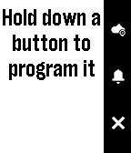
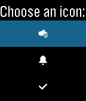

# WatchIR

A programmable infrared remote controller smartstrap for the Pebble Time.

## Features
* Program the Pebble's up, select, and down buttons by pointing an IR remote controller at the smartstrap's IR receiver while pressing a button on the remote
* Choose from a set of 50 icons to denote each Pebble button's programmed function
* Tap a programmed Pebble button to emit the programmed IR code from the smartstrap

## Acknowledgements
* "basic ui" icon set designed by freepik: http://www.flaticon.com/packs/basic-ui
