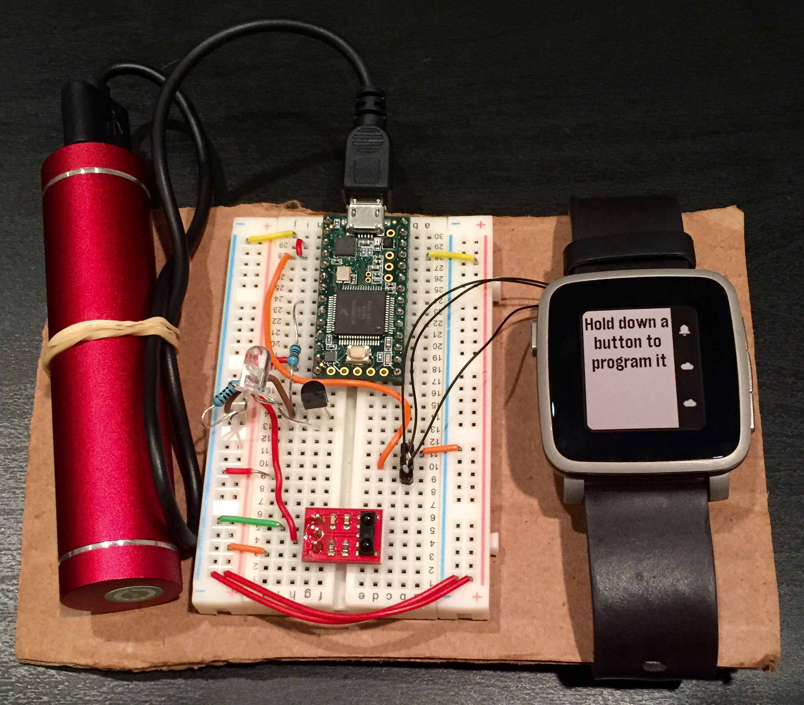

# WatchIR

A programmable infrared remote controller smartstrap for the Pebble Time.

## Features
* Program the Pebble's up, select, and down buttons by pointing an IR remote controller at the smartstrap's IR receiver while pressing a button on the remote
* Choose from a set of 50 icons to denote each Pebble button's programmed function
* Tap a programmed Pebble button to emit the programmed IR code from the smartstrap

## Hardware

### Required Parts
* Pebble Time or Pebble Time Steel smartwatch
  * https://getpebble.com/shop
* Teensy 3.1 USB development board
  * https://www.pjrc.com/store/teensy31.html
* Infrared LED
  * https://www.sparkfun.com/products/9469
* TSOP85 infrared receiver breakout board
  * https://www.sparkfun.com/products/8554
* BC547 NPN Transistor
  * https://www.sparkfun.com/products/8928
* 1kΩ resistor
* 100Ω resistor
* (optional) Kocaso 2600 mAh USB-chargable battery

## Schematic

## Acknowledgements
* "basic ui" icon set designed by freepik: http://www.flaticon.com/packs/basic-ui
